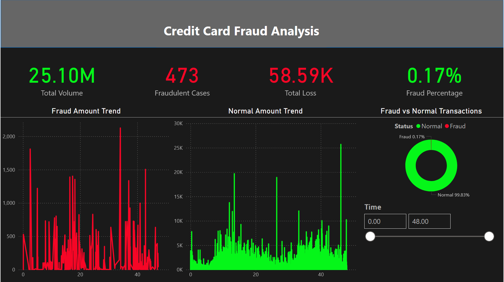

# Credit Card Fraud Analysis

## Overview
This project focuses on identifying fraudulent transactions within a large credit card dataset. I built this dashboard to visualize the patterns of fraud vs. normal activity and to help financial institutions minimize losses by detecting anomalies in real-time.

## What I did in this project
* **Data Cleaning & Transformation:** I handled a dataset with a total volume of $25.10M. One of the main challenges was converting time units from seconds into a 48-hour window to better analyze transaction cycles. 
* **Fraud Detection Logic:** I separated fraudulent cases (473 cases) from normal transactions to compare their trends.  I found that while fraud only accounts for 0.17% of total transactions, it resulted in a $58.59K loss. 
* **Trend Analysis:** I created two distinct line charts to compare "Fraud Amount Trends" against "Normal Amount Trends" over time, which helped in identifying specific peaks where fraudulent activity spikes. 

## Technical Stack
* **Power BI:** For building the interactive dashboard and data visualization. 
* **DAX:** Used for complex measures and time-based transformations. 
* **Data Source:** Credit card transaction logs. 

## Dashboard Preview

## Author
Mohab Emad
